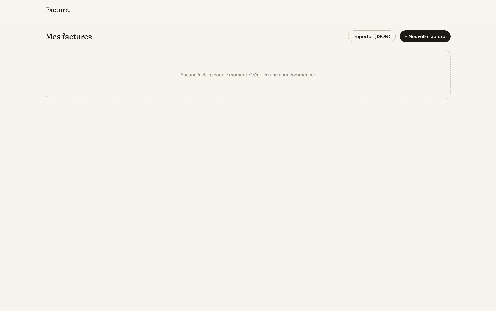
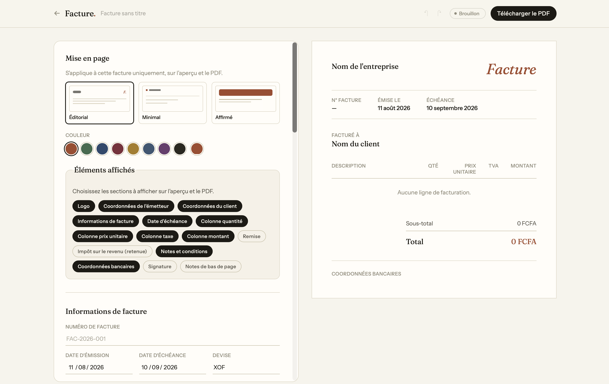

<div align="center">
  

  # Facture.

  Générateur de factures rapide, élégant et 100 % privé — dans le navigateur ou en app de bureau.

</div>





## À propos

**Facture.** est une application de facturation pensée pour les indépendants et petites structures : on remplit une facture, on l'ajuste visuellement, on l'exporte en PDF. Aucune donnée ne quitte jamais l'appareil — tout est stocké en local (`localStorage`), il n'y a ni compte, ni serveur, ni base de données.

## Fonctionnalités

- **Édition en temps réel** — formulaire à gauche, aperçu fidèle au PDF à droite, mis à jour instantanément.
- **Export PDF vectoriel** — généré avec jsPDF (texte net et sélectionnable, pas une capture d'écran).
- **3 mises en page** (éditorial, minimal, bold) et une couleur d'accent par facture, appliquées identiquement à l'écran et au PDF.
- **Sections à la carte** — logo, coordonnées, colonnes du tableau, remise, retenue à la source, signature, notes de bas de page : chaque bloc peut être affiché ou masqué.
- **Signature** — dessinée à la main (canvas) ou importée en image.
- **Éditeur de texte riche** pour la description des lignes (gras, italique, listes).
- **Retenue à la source** distincte de la TVA (calcul `brut × (1 − taux)`), en plus de la TVA classique.
- **Tableau de bord** — recherche, filtres par statut (brouillon, envoyée, payée, en retard, annulée), vues grille/liste.
- **Dupliquer, renommer, suivre le statut, annuler/rétablir** chaque facture.
- **Export / import** de toutes les factures en JSON (sauvegarde complète) ou CSV (tableur).
- **Application de bureau** (macOS, avec support Windows/Linux via Tauri) en plus de la version web.

## Stack technique

- [Vue 3](https://vuejs.org/) (`<script setup>`) + [TypeScript](https://www.typescriptlang.org/)
- [Vite](https://vite.dev/) 7
- [Tailwind CSS](https://tailwindcss.com/) v4
- [jsPDF](https://github.com/parallax/jsPDF) + [jspdf-autotable](https://github.com/simonbengtsson/jsPDF-AutoTable) pour la génération PDF
- [Tiptap](https://tiptap.dev/) pour l'édition de texte riche
- [Tauri](https://tauri.app/) v2 pour l'application de bureau
- [Vitest](https://vitest.dev/) pour les tests

## Installation

### Prérequis

- [Node.js](https://nodejs.org/) 22+
- npm

### Développement (web)

```bash
git clone https://github.com/<votre-compte>/FLOFACTURES.git
cd FLOFACTURES
npm install
npm run dev
```

L'application est servie sur `http://localhost:5173`.

### Build web (production)

```bash
npm run build
npm run preview
```

Le résultat statique (`dist/`) peut être déployé sur n'importe quel hébergeur (Vercel, Netlify, Coolify, etc.) — c'est une pure application client, aucun serveur applicatif requis.

## Application de bureau

Facture. peut aussi être empaquetée en application native via [Tauri](https://tauri.app/), sur **macOS**, **Windows** et **Linux**.

### Prérequis supplémentaires

- [Rust](https://www.rust-lang.org/tools/install) (`rustup`)
- macOS : Xcode Command Line Tools
- Windows : [Microsoft C++ Build Tools](https://tauri.app/start/prerequisites/#windows) (via Visual Studio)
- Linux : dépendances webkit2gtk — voir le [guide officiel Tauri](https://tauri.app/start/prerequisites/#linux)

### Lancer en mode développement

```bash
npm run dev:desktop
```

### Construire l'application installable

```bash
npm run build:desktop
```

Cette commande compile pour l'OS courant (Tauri ne fait pas de cross-compilation) :

| OS | Sortie |
| --- | --- |
| macOS | `src-tauri/target/release/bundle/macos/Facture.app` et `bundle/dmg/*.dmg` |
| Windows | `src-tauri/target/release/bundle/msi/*.msi` (à builder depuis Windows) |
| Linux | `src-tauri/target/release/bundle/deb/*.deb` et `bundle/appimage/*.AppImage` (à builder depuis Linux) |

> Pour distribuer sur Windows ou Linux, il faut lancer `npm run build:desktop` depuis une machine (ou CI) de cet OS — seul le build macOS a été testé dans ce dépôt à ce jour.

L'app n'étant pas signée (pas de compte développeur Apple/Microsoft), le premier lancement peut nécessiter de contourner Gatekeeper (macOS : clic droit → Ouvrir) ou SmartScreen (Windows : "Informations complémentaires" → "Exécuter quand même").

## Tests

```bash
npx vitest run
```

## Confidentialité

Aucune donnée saisie (informations client, montants, signature) ne transite par un serveur : tout reste dans le stockage local du navigateur ou de l'application. Le bouton *Exporter (JSON)* permet de sauvegarder l'ensemble de ses factures pour les transférer ou les archiver.

## Licence

Projet privé — tous droits réservés.
